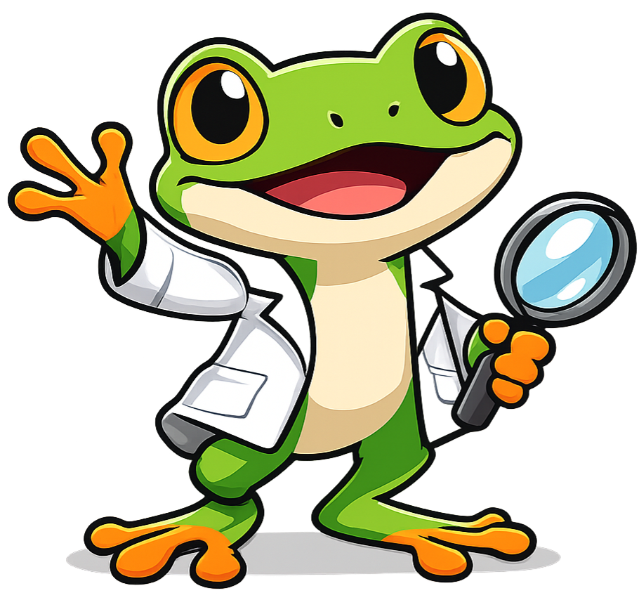

# About This Course

## Hello from Mendel

{ width="200px" align="left"}

Hello!  I am Mendel the tree frog.  I will be your guide in this course.  I was named after Gregor Mendel who was a botanist and teacher.  Gregor was the first person to lay the mathematical foundation of the science of genetics.  I pop up at key checkpoints in each chapter to welcome you to new chapters, give friendly reminders, highlight common pitfalls, guide your learning path and help you celebrate your progress.

## Why Biology Matters Now More Than Ever

Biology sits at the center of today’s most urgent challenges—pandemics, food security, climate resilience, and biotechnology. When you learn to reason like a biologist you gain the ability to analyze complex systems, interpret data, and design experiments that improve lives. The scale of learners tackling these ideas is enormous:

**In the United States (2025):**

- More than **265,000 students** take the AP Biology exam each year, making it the most popular advanced lab-science assessment[^1]
- Biological and biomedical sciences account for **over 6% of all U.S. bachelor’s degrees**, a share that has more than doubled since the 1980s[^2]
- Employment for biological scientists is projected to grow **7% this decade**, faster than the average for all occupations[^3]

**Worldwide:**

- UNESCO estimates that **60% of low- and lower-middle-income countries** have prioritized strengthening biology and health curricula as part of their Sustainable Development Goal 4 roadmaps[^4]
- Global biotechnology revenues now exceed **$1.2 trillion annually**, fueling demand for students who understand genetics, cellular systems, and bioinformatics[^5]

By studying with this open textbook you are joining a global movement of learners preparing to solve pressing biological questions across medicine, agriculture, ecology, and synthetic biology.

!!! mascot-welcome "Gregor Can Help!"
    
    
    Traditional biology textbooks frequently cost between **\$150** and **\$300** and still rely on static diagrams that make it hard to visualize molecular processes. That barrier is especially steep for community-college and dual-enrollment students balancing work, family, and school.

    Gregor—the tree frog learning mascot for this course—believes curiosity should be the only prerequisite. Every chapter, simulation, and formative check is free, remixable, and continuously updated. Let me hop in alongside you so we can explore living systems without hitting a paywall.

## Learning Through Interactive Visualization

Instead of memorizing disconnected facts, you will build intuition with **browser-based MicroSims** that let you manipulate real biological data and models:

- Explore diffusion, osmosis, and membrane transport by adjusting concentration gradients in real time
- Simulate gene regulation networks, toggle transcription factors, and watch downstream proteins respond
- Model population dynamics, epidemiological spread, and ecological feedback loops with adjustable parameters
- Analyze enzyme kinetics by tuning substrate levels and inhibitors while plotting Michaelis–Menten curves

These simulations become laboratories you can reopen any time—no wet lab required—so conceptual understanding is paired with authentic experimentation.

## You Will Have Fun

Biology is full of wonder, and this course keeps that sense of discovery alive. Gregor’s mascot admonitions provide context-sensitive nudges, the narrative case studies tie each unit to real-world breakthroughs, and the MicroSims encourage playful exploration. Whether you aspire to study medicine, design sustainable materials, or decode new genomes, the goal is the same: help you *enjoy* thinking like a biologist while mastering the skills needed for college credit.

## Background

The scope of this course was anchored to the following guiding question:

!!! prompt
    What standards organizations describe the concepts that should appear in a high-school Biology course that maximizes a student’s chance of earning college credit?

Since early 2025 we have iterated on AI-assisted authoring workflows to pair accurate biology content with interactive assets. This edition was produced with Claude Code Skills on February 3, 2026, with an emphasis on tighter alignment to AP Biology, NGSS Life Science performance expectations, and story-driven MicroSims.

## About Dan McCreary

Dan McCreary is a semi-retired AI researcher, solution architect, and educator who has spent more than three decades helping Fortune 100 organizations reason over massive datasets. At Optum he founded the Generative AI Center of Excellence and led the team that built one of the world’s largest healthcare knowledge graphs—spanning over 25 billion vertices—to unify member, provider, and patient insights. Dan’s deep background in knowledge representation and systems thinking underpins the precise learning graphs and intelligent textbook workflows used throughout this course.

He is the co-author of *Making Sense of NoSQL* (Manning Publications), the founding chair of the NoSQL Now! conference, and a frequent keynote speaker on semantic search, ontology strategy, and AI hardware. Beyond industry, Dan has mentored students as a STEM volunteer since 2014 now applies the same rigor to building open AP Biology resources.  You can visit the [Intelligent Textbooks Case Studies](https://dmccreary.github.io/intelligent-textbooks/case-studies/) to see over 70 textbooks that Dan has create or co-created with other authors.

**Selected credentials**

- B.A. in Physics and Computer Science from Carleton College
- M.S.E.E. from the University of Minnesota;
- MBA coursework at the University of St. Thomas (33 of 36 credits complete)
- Patent holder in semantic search and ontology management techniques
- Advocate for large-scale Enterprise Knowledge Graph adoption across healthcare and education
- Long-time promoter of accessible, low-cost AI-powered learning experiences

## References

[^1]: College Board. [2024 AP Score Distributions](https://apstudents.collegeboard.org/about-ap-scores/score-distributions). Reporting 265,356 AP Biology exam takers.
[^2]: National Science Foundation. *Science and Engineering Indicators 2024*, Table 2-9, showing growth in biological and biomedical bachelor’s degrees.
[^3]: U.S. Bureau of Labor Statistics. *Occupational Outlook Handbook: Biological Scientists* (2024).
[^4]: UNESCO. *SDG 4 Midterm Progress Review* (2023), prioritization of life-science curricula.
[^5]: McKinsey & Company. *The Bio Revolution: Innovations Transforming Economies, Societies, and Our Lives* (2020) and 2024 biotech market update estimating $1.2 trillion in annual revenue.
