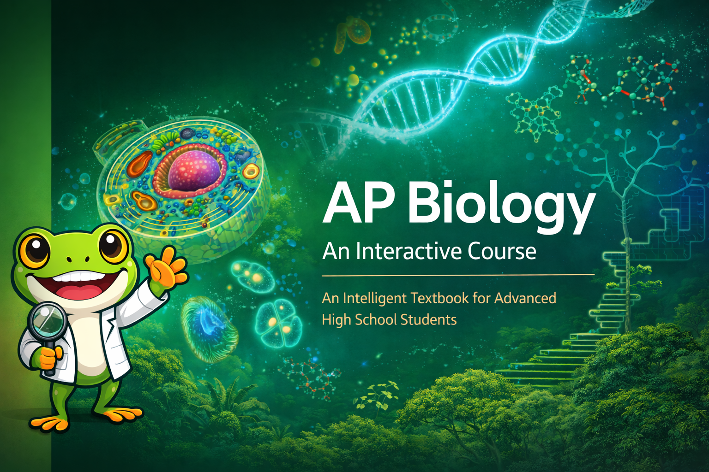

# Biology: An Interactive Course

{ width="100%" }

An interactive intelligent textbook for Biology, designed for advanced high school students (grades 11–12) preparing for the Biology exams that provide college credit. This course covers all eight units suggested by the AP® College Board — from the chemistry of macromolecules to the dynamics of ecosystems — with hands-on simulations, interactive learning graphs, and college placement exam strategies throughout.
This course is not associated with The College Board in any way and no endorsement from The College Board are implied.

## What You Will Learn

| Unit | Topic |
|------|-------|
| 1 | Chemistry of Life — macromolecules, water, buffers |
| 2 | Cell Structure and Function — organelles, membrane transport |
| 3 | Cellular Energetics — enzymes, photosynthesis, respiration |
| 4 | Cell Communication and the Cell Cycle — signal transduction, mitosis |
| 5 | Heredity — meiosis, Mendelian and non-Mendelian genetics |
| 6 | Gene Expression and Regulation — central dogma, CRISPR, epigenetics |
| 7 | Natural Selection and Evolution — Hardy-Weinberg, speciation, phylogenetics |
| 8 | Ecology — population dynamics, food webs, biogeochemical cycles |

## Features

- **Interactive MicroSims** — computational simulations for every major concept
- **Learning Graph** — visual map of all 375+ course concepts and dependencies
- **Bloom's Taxonomy Alignment** — objectives at all six cognitive levels
- **College Test Exam Strategies** — targeted tips and common misconception warnings from Gregor
- **Chapter Quizzes** — self-assessment questions aligned to college credit exam style

## How to Use This Book

Navigate using the sidebar on the left. Start with the [Course Description](course-description.md) for a full overview, then explore the [Learning Graph](learning-graph/index.md) to see how concepts connect before diving into chapters.
