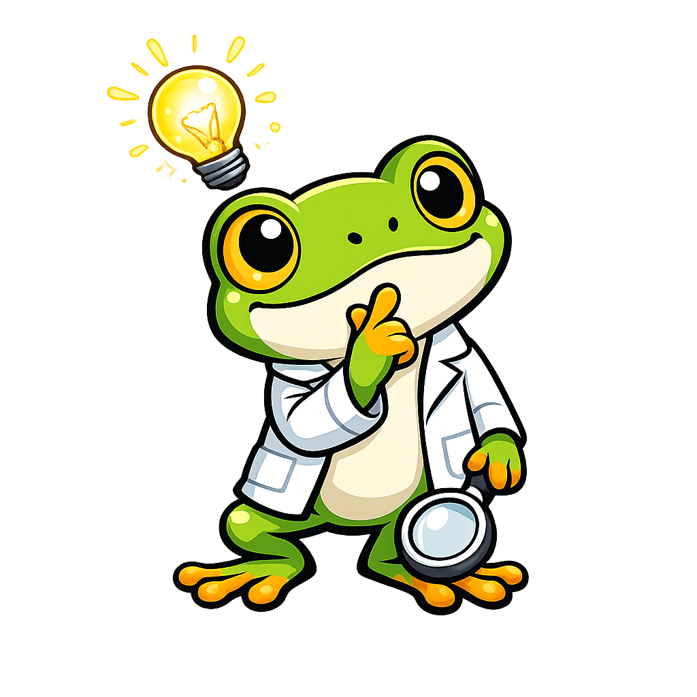
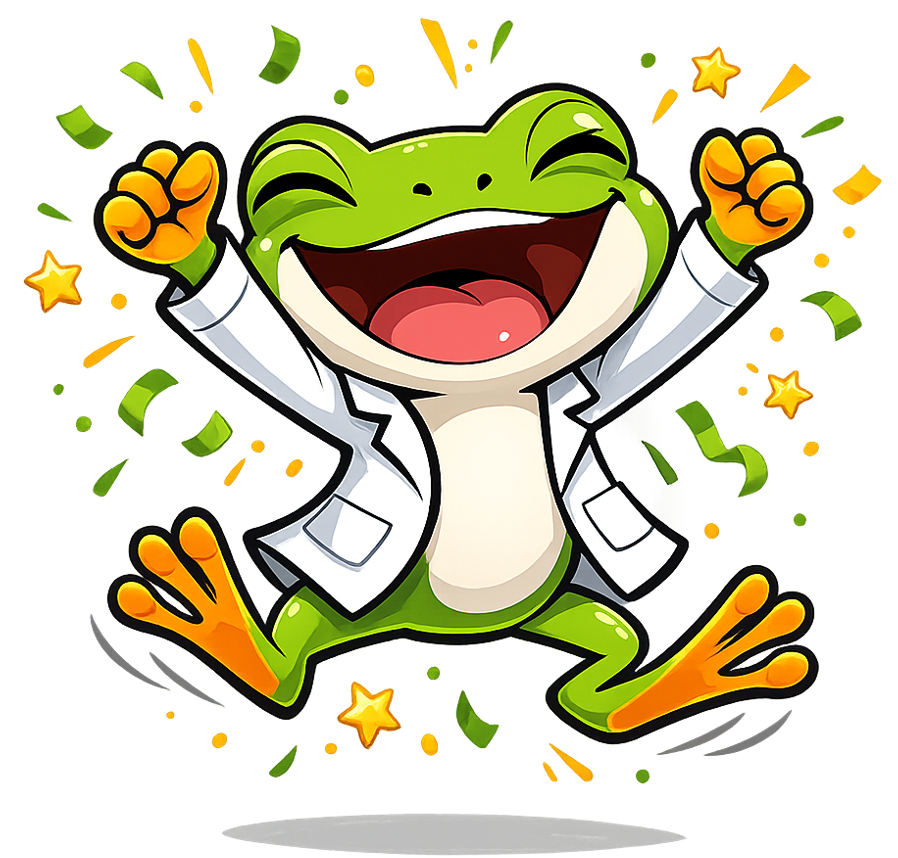
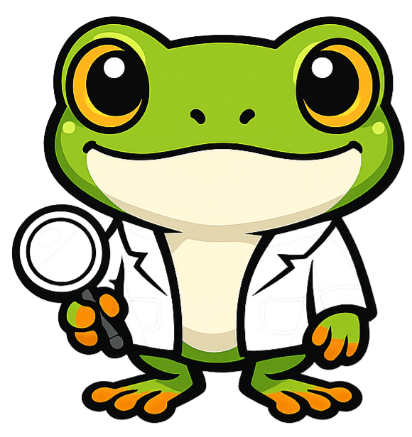

# Gregor the Tree Frog - Mascot Test

This page shows all mascot images as well as the admonition styles for reference. Check that all the images have a transparent background
and do not have excessive padding around the drawing.
Note that the images have a dashed blue border around them so you can clearly see the padding.

## Image Tests

1. Welcome
{ width="150px"}
2. Thinking
{ width="150px"}
3. Tip
{ width="150px"}
4. Warning
{ width="150px"}
5. Encouraging
{ width="150px"}
6. Celebration
{ width="150px"}
7. Neutral
{ width="150px"}

## Admonition Tests

!!! mascot-welcome "Gregor Welcomes You!"
    
    Welcome, investigators! I'm Gregor the Tree Frog, your guide through
    the living world of AP Biology. From the chemistry inside a cell to
    the dynamics of entire ecosystems — Let's investigate!

!!! mascot-thinking "Key Insight"
    
    Notice that every major biological process — from photosynthesis
    to protein synthesis — depends on the same fundamental chemistry
    you learned in Unit 1. Biology is deeply connected.

!!! mascot-tip "Gregor's Tip"
    
    When you see a question about enzyme inhibition on the AP exam,
    always ask: *Does the inhibitor bind the active site or somewhere else?*
    That single question tells you whether it's competitive or noncompetitive.

!!! mascot-warning "Common Mistake"
    
    Don't confuse *genotype* and *phenotype*. The genotype is the genetic
    instruction set (DNA). The phenotype is the observable result. The same
    phenotype can come from different genotypes — that's why test crosses exist!

!!! mascot-encourage "You've Got This!"
    
    Hardy-Weinberg equilibrium feels intimidating at first — but once you see
    it as a *null hypothesis* for evolution, it all clicks. Stick with it.
    You're closer than you think!

!!! mascot-celebration "Excellent Work!"
    
    You've just worked through the entire central dogma — DNA replication,
    transcription, and translation. That's the molecular blueprint of life.
    Outstanding work, investigator!

!!! mascot-neutral "A Note from Gregor"
    
    AP Biology covers a lot of ground — from atoms to ecosystems. Each unit
    builds on the last, so if something feels shaky, it's worth going back
    to reinforce it before moving forward.
