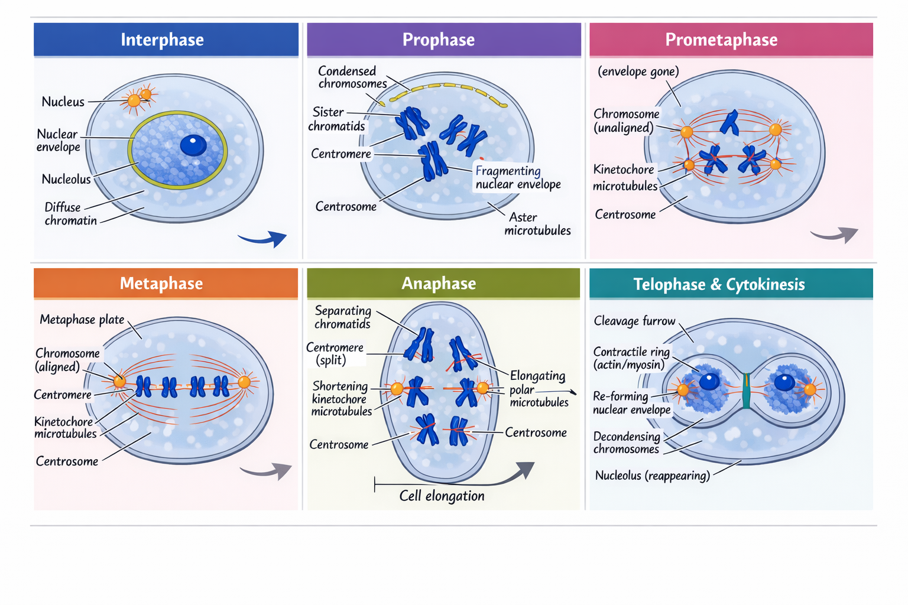

# Click to Enlarge Image Feature

!!! prompt
    run the /book-installer image zoom Glightbox to click to         
    enlarge images

Note that this adds about 11 lines to the `mkdocs.yml` file

```yml
plugins:
  - glightbox:
      touchNavigation: true
      loop: false
      effect: zoom
      slide_effect: slide
      width: 100%
      height: auto
      zoomable: true
      draggable: true
      auto_caption: false
      caption_position: bottom
```

## Test

