# Seeds of Genetics: Gregor Mendel

Cover Prompt

Please generate a wide-landscape 16:9 cover image showing Gregor Mendel in his Brno monastery garden, surrounded by tall pea plants, handwritten data tables, and sunlight filtering through greenhouse glass. Include the title text “Seeds of Genetics: Gregor Mendel” integrated into the scene.

Narrative Prompt

Narrate the life of Gregor Mendel in a hopeful, accessible tone for high-school readers, emphasizing perseverance, curiosity, and meticulous observation. Highlight how limited resources, failed exams, and skeptical peers did not prevent him from discovering the laws of inheritance. Balance factual detail with emotional resonance, showing how his notebooks, patience, and honesty became the foundation for modern genetics.

### Prologue – Quiet Questions in a Monastery

Mendel arrived in Brno as a shy teacher-in-training, more comfortable with plants than podiums. The prologue introduces his curiosity about how traits were passed down and the solitude he found among greenhouse benches when lecture halls felt overwhelming.

## Panel 1: Leaving the Village School
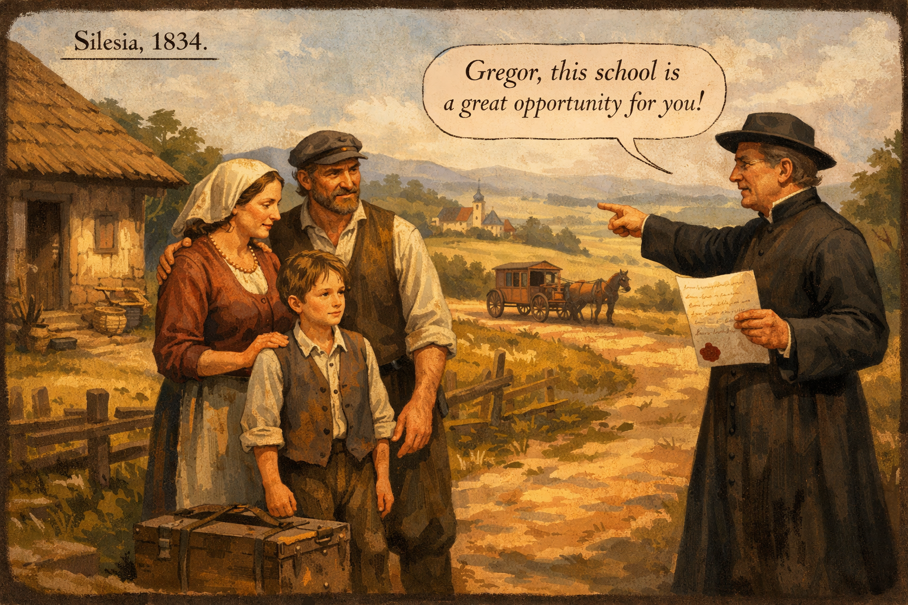

Please generate a wide-landscape 16:9 image set in Silesia around 1834. Show young Gregor in a simple rural village, standing beside his parents with a small trunk. A local priest points toward a distant boarding school carriage. Include rolling farmland, a modest farmhouse, and the priest’s letter recommending Gregor for further study.

Born to a farming family with limited means, the young Johann Gregor Mendel impressed the village priest with his curiosity and academic talent. At age eleven he left his home in Silesia to attend a boarding school, carrying little more than a trunk and his parents’ hopes. This panel illustrates how mentors and education can change the trajectory of a child’s life long before the world knows their name.

## Panel 2: A Scholar in Humble Surroundings
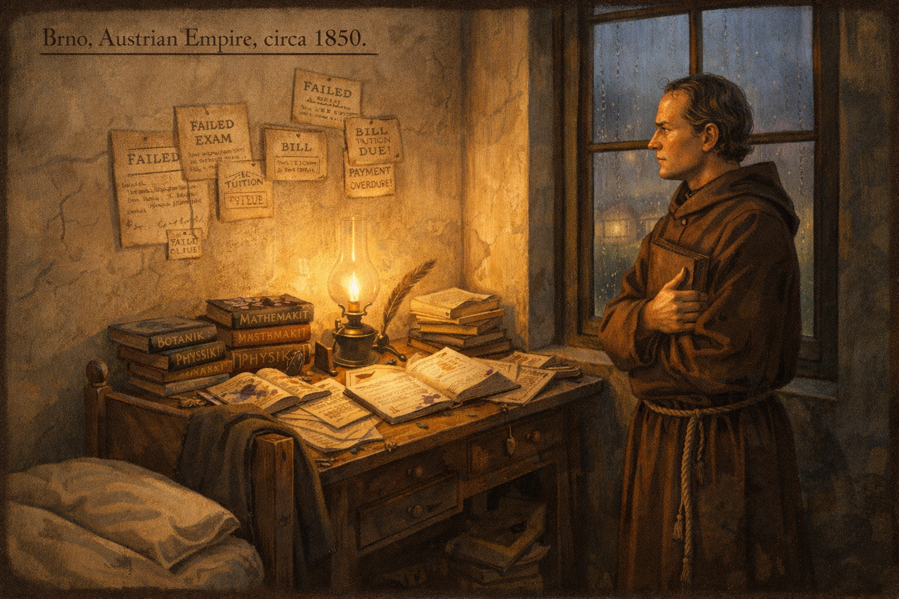

Please generate a wide-landscape 16:9 image depicting Mendel in his dormitory at St. Thomas’s Abbey in Brno (Austrian Empire, circa 1850) lit by a single oil lamp casting long shadows. Include:
1. A narrow bed with a wool blanket and a coat draped across the footboard.
2. Scattered textbooks titled “Botanik,” “Mathematik,” and “Physik,” each filled with marginal notes and pressed leaves.
3. Multiple failed exam notices and tuition bills tacked unevenly to a cracked plaster wall.
4. A cluttered desk featuring envelopes requesting financial aid, a quill, ink stains, and a half-finished letter.
5. A rain-streaked window revealing the monastery garden with a faint glow of greenhouse lamps.
6. Mendel standing near the window wearing a simple brown robe, clutching a worn leather journal and gazing toward the garden with determined eyes.

Mendel’s early years inside St. Thomas’s Abbey were marked by financial strain, illness, and repeated failures at formal teaching exams. Instead of giving up, he leaned on the monastery’s encouragement to pursue questions he could answer himself. This panel shows that scientific journeys often begin outside traditional success stories.

## Panel 3: The Garden Laboratory
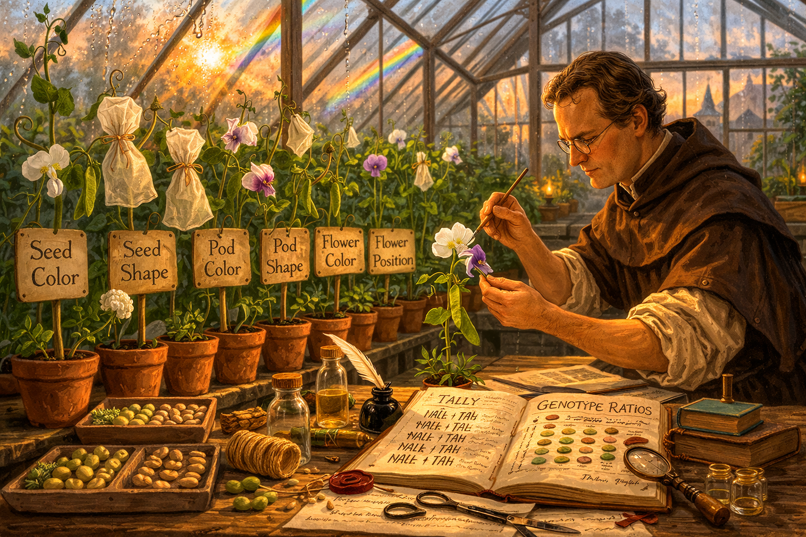

Please generate a wide-landscape 16:9 image set inside the St. Thomas’s Abbey greenhouse in Brno at dawn, around 1856. Include:
1. Dewy glass panes with sunlight refracting into rainbow streaks across rows of pea plants.
2. Terracotta pots labeled with wooden tags (Seed Color, Seed Shape, Pod Color, Pod Shape, Flower Color, Flower Position, Stem Length).
3. Muslin bags tied with twine around select blossoms to prevent accidental pollination.
4. Mendel wearing rolled-up sleeves, spectacles perched on his nose, using a delicate paintbrush to transfer pollen.
5. An open notebook showing tally marks and genotype ratios beside sealing wax, twine, and small glass vials.
6. A low wooden stool with trays of pea seeds sorted by color and shape.

By choosing peas with clear, contrasting traits and isolating generations, Mendel designed fair tests even without microscopes or chemical reagents. His calm routine—bagging flowers, transferring pollen, counting seeds—reveals how careful planning turns simple organisms into powerful models.

## Panel 4: Mountains of Data
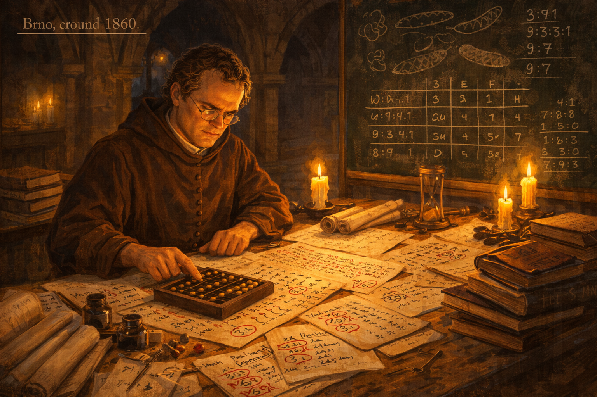

Panel 4
Please generate a wide-landscape 16:9 image showing Mendel in the abbey’s cloister study in Brno around 1860, illuminated by candles, surrounded by data. Include:
1. A heavy wooden table covered with parchment sheets, scrolls, and bound notebooks organized in stacks.
2. Columns of handwritten numbers with ratios circled in red (3:1, 9:3:3:1, 9:7) and annotations like “Dominant” and “Rezessiv.”
3. An abacus, multiple quills, ink pots, and blotting paper scattered across the workspace.
4. A chalkboard featuring pea pod sketches, Punnett-square-like grids, and ratio equations.
5. A small hourglass half-emptied to convey countless late nights.
6. Mendel mid-calculation, brow furrowed but calm, one hand on the abacus while the other points to a column of numbers.

In the cloister study overlooking Brno’s streets, Mendel wrestled with thousands of data points. Night after night he sorted seeds, verified counts, and checked ratios until patterns emerged. The panel emphasizes discipline: Mendel trusted numbers more than assumptions, building a framework of dominant and recessive traits from pure observation.

## Panel 5: Silence in the Lecture Hall
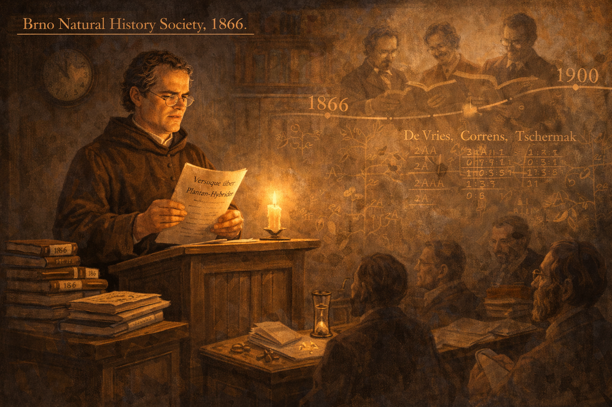

Please generate a wide-landscape 16:9 image depicting Mendel presenting to the Brno Natural History Society lecture hall in 1866. Include:
1. A small wooden podium with Mendel holding a manuscript titled “Versuche über Pflanzen-Hybriden.”
2. Only a handful of attendees seated in shadow, some whispering skeptically, others taking cursory notes.
3. Stacks of unopened journals labeled “1866” beside the podium.
4. A wall clock fading into a timeline that stretches to 1900, where ghostly silhouettes of de Vries, Correns, and Tschermak appear reading Mendel’s work.
5. A subtle overlay of pea plant diagrams connecting the lecture hall to future discoveries.
6. Warm but subdued lighting emphasizing Mendel’s calm determination in the face of indifference.

Mendel’s 1866 presentation fell flat—few scientists attended his talk, and the paper stayed tucked away in a regional journal. Yet his meticulous notes endured. Decades later, others rediscovered his ratios and realized they described universal laws. This panel reassures students that accurate records outlive immediate acclaim.

## Panel 6: Abbot Responsibilities
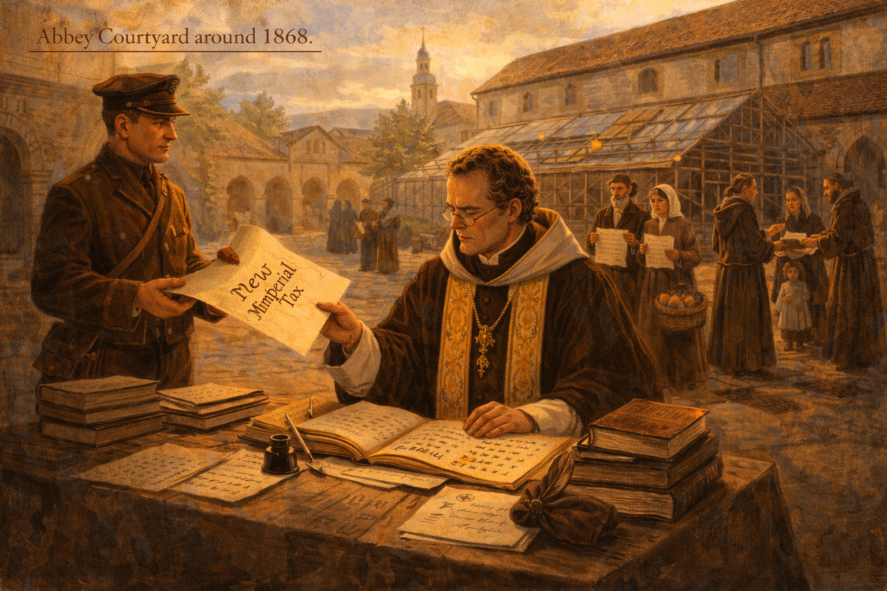

Please generate a wide-landscape 16:9 image set in the abbey courtyard around 1868. Include:   
1. Mendel in formal abbot robes reviewing tax ledgers spread across a table.  
2. A government courier handing him a scroll marked “New Imperial Tax.”  
3. Townspeople waiting with petitions, some carrying baskets of produce.  
4. The greenhouse behind them partially covered in scaffolding for repairs.  
5. Monks in the distance distributing bread to families.  
6. Late-afternoon light casting long shadows across the stone courtyard.

After his experiments, Mendel became abbot and suddenly found himself managing finances, disputes, and civic responsibilities. Administrative duties, particularly a dispute over government taxes, consumed time he once devoted to pea plants. This panel highlights that even great scientists must juggle leadership roles.

## Panel 7: Letters to Fellow Scientists
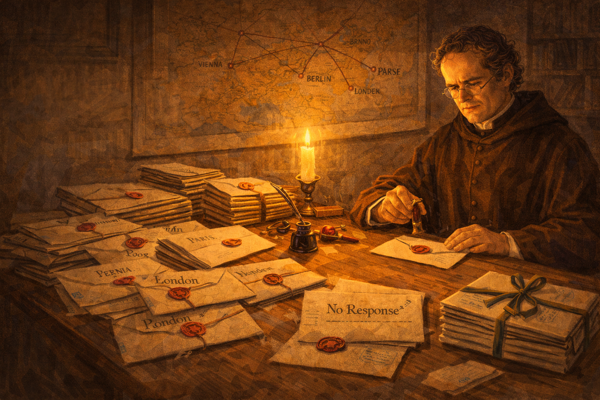

Please generate a wide-landscape 16:9 image of Mendel at a writing desk in 1870. Include:  
1. A large desk cluttered with sealed letters stamped for Vienna, Berlin, London, and Paris.  
2. A map on the wall with string routes connecting Brno to European scientific centers.  
3. A returned envelope marked “No Response” lying beside an inkpot.  
4. Mendel sealing a fresh letter with wax, expression hopeful yet tired.  
5. A bundle of reprints tied with ribbon ready for mailing.  
6. Candlelight illuminating the desk while the rest of the room fades into shadow.

Despite administrative burdens, Mendel continued writing to peers, hoping to spark dialogue about inheritance. Many letters went unanswered, but he kept sending data summaries and requests for collaboration. This panel underscores the importance of scientific communication—even when replies are scarce.

## Panel 8: Observing Other Species
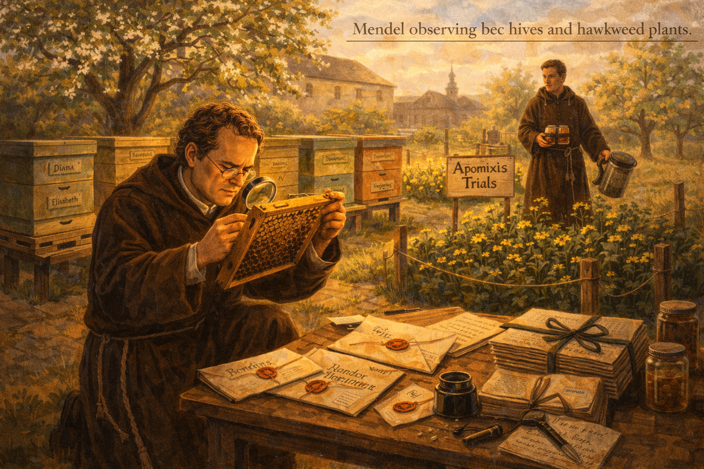

Please generate a wide-landscape 16:9 image of Mendel observing bee hives and hawkweed plants in the abbey garden around 1871. Include:  
1. Bee boxes labeled with queen names and observation dates.  
2. Hawkweed beds fenced with signs reading “Apomixis Trials.”  
3. Mendel kneeling with a magnifying glass examining a bee frame.  
4. An assistant monk carrying jars of nectar samples and a smoker.  
5. A portable table displaying notebooks filled with sketches of bee wings and hawkweed petals.  
6. Dappled late-spring sunlight filtering through fruit trees.

Mendel’s curiosity expanded to bees and hawkweed, though these projects proved more complex than peas. Honeybee behavior and hawkweed’s unusual reproduction challenged his methods, reminding students that not every experiment yields clear ratios. The panel encourages resilience when data becomes messy.

## Panel 9: Revisiting the Data
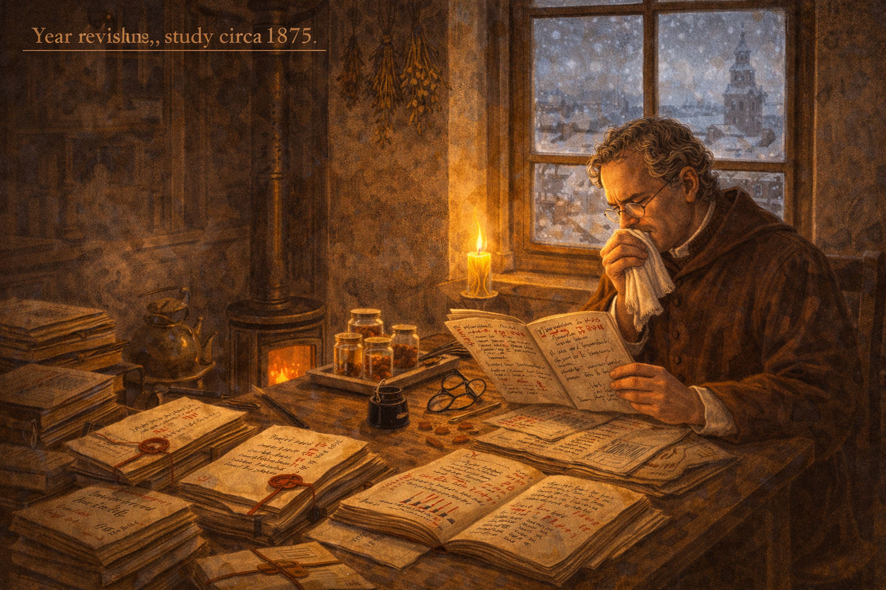

Please generate a wide-landscape 16:9 image inside Mendel’s study circa 1875, with gray hair starting to show. Include:  
1. Stacks of original pea notebooks opened with red annotations and bookmarks.  
2. A magnifying lens, spectacles, and blotting paper beside an inkpot.  
3. Mendel seated, coughing into a handkerchief while comparing charts.  
4. A coal stove glowing softly in the corner.  
5. Bundles of dried herbs and a steaming teapot on a tray.  
6. Snow visible through the window overlooking Brno rooftops.

In later years, Mendel revisited his original pea data, refining interpretations and double-checking calculations. Though health problems slowed him down, he never abandoned the pursuit of understanding heredity. This panel illustrates lifelong dedication to accuracy.

## Panel 10: Ripples in Brno’s Community
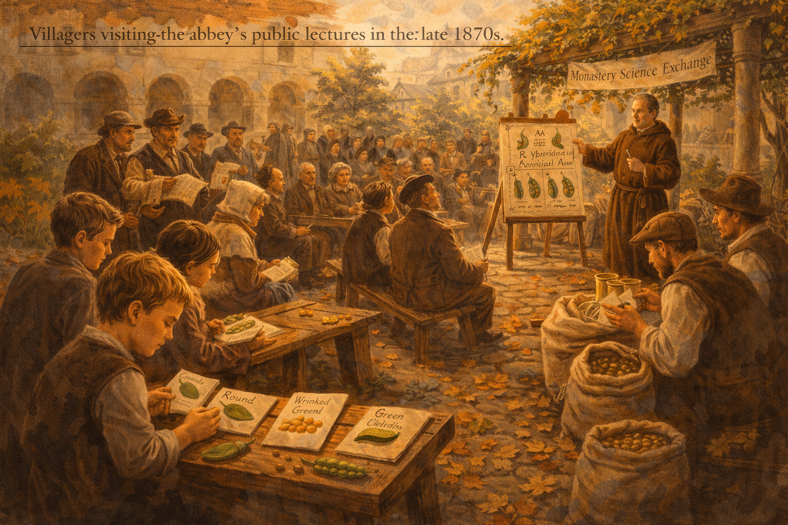

Please generate a wide-landscape 16:9 image showing villagers visiting the abbey’s public lectures in the late 1870s. Include:  
1. Young students at benches examining pea pods labeled with trait cards.  
2. Farmers comparing seed sacks and pointing to illustrated hybrid charts.  
3. Mendel under a grapevine pergola explaining diagrams on an easel.  
4. Townspeople seated on benches taking notes while others debate animatedly.  
5. Banners reading “Monastery Science Exchange” strung between columns.  
6. Fallen autumn leaves scattered across the cobblestones.

Even without international fame, Mendel’s work inspired local curiosity. Students, farmers, and townspeople visited the abbey to learn practical breeding tips. This panel reminds readers that science ripples outward through communities before reaching textbooks.

## Panel 11: Passing the Torch
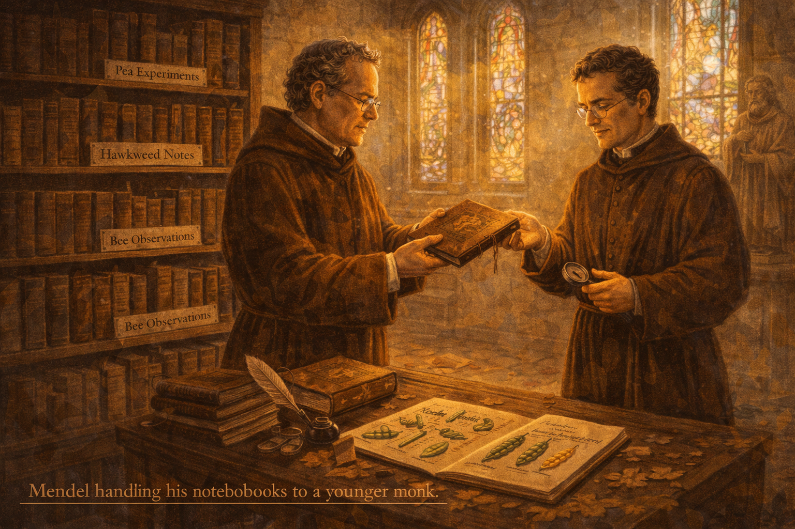

Please generate a wide-landscape 16:9 image of Mendel handing his notebooks to a younger monk in the early 1880s. Include:  
1. Shelves labeled “Pea Experiments,” “Hawkweed Notes,” and “Bee Observations” filled with leather-bound volumes.  
2. Mendel, older and slightly stooped, passing a notebook to a spectacled younger monk holding a magnifier.  
3. Afternoon light streaming through stained-glass windows onto a table of preserved pea specimens.  
4. A quill and magnifying set laid out for the next generation.  
5. A small statue of St. Thomas watching over the exchange.  
6. Dust motes visible in the warm light, adding reverence to the scene.

Near the end of his life, Mendel ensured his records were preserved, entrusting younger monks with the greenhouse and notebooks. He believed future scientists would one day examine the same data with new tools. This panel emphasizes mentorship and preserving original data sources.

## Panel 12: Rediscovery and Celebration
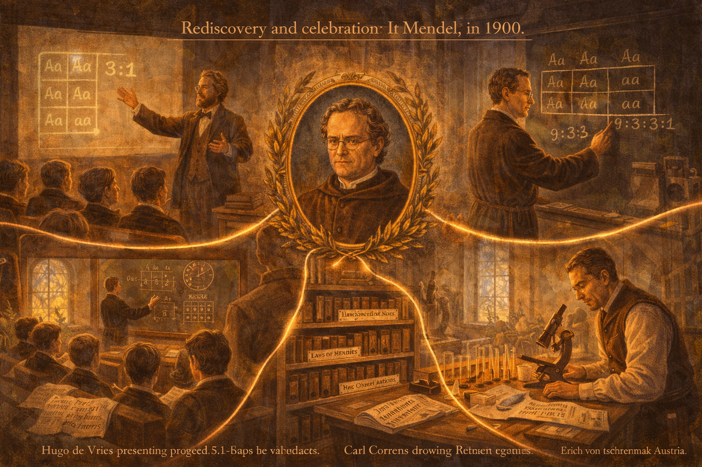

Please generate a wide-landscape 16:9 image set in 1900 showing three laboratories connected visually. Include:  
1. Hugo de Vries presenting a projected 3:1 ratio to Dutch students.  
2. Carl Correns drawing Punnett squares on a chalkboard in Germany.  
3. Erich von Tschermak examining barley hybrids under a microscope in Austria.  
4. A central portrait of Mendel framed with laurels uniting all scenes.  
5. Glowing lines or cables linking the labs to symbolize shared discovery.  
6. Newspapers on benches with headlines announcing “Laws of Heredity Confirmed.”  

Although Mendel did not witness it, the dawn of the 20th century finally celebrated his work. Scientist after scientist confirmed his ratios in new organisms, laying the groundwork for genetics. This panel shows students that recognition may arrive late, but truth endures.

Above are the three scientist that confirmed and popularized Mendel's work.

1. Hugo de Vries presenting to Dutch students.
2. Carl Correns in Germany
3. Erich von Tschermak in Austria

### Epilogue – What Made Mendel Different?

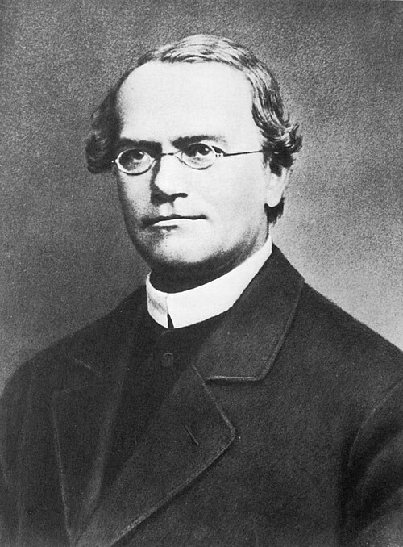

Mendel combined humility with scientific rigor. He chose a manageable system, documented everything precisely, and remained patient when praise never came. His story reminds students that curiosity, honesty, and persistence can rewrite textbooks—even if the applause arrives long after the experiment is done.

| Challenge | How Mendel Responded | Lesson for Today |
|-----------|----------------------|------------------|
| Failed teaching exams and limited funding | Sought support from the monastery and focused on small, controllable experiments | Define success on your own timeline; small labs can change science |
| Scientific isolation and skepticism | Published data anyway, kept detailed notebooks, trusted the evidence | Accuracy matters more than popularity; good notes help future scientists |
| Lack of advanced tools | Used peas, patience, and statistical reasoning | Simple models plus rigorous thinking can reveal universal principles |

### Call to Action

Use Mendel’s approach in your own projects: pick a question you can measure, record everything meticulously, and don’t let early setbacks stop you from sharing results. Run the Punnett Square or Dihybrid Cross MicroSims in this course and recreate Mendel’s ratios yourself.

*"My scientific work afforded me great satisfaction, and I am convinced that it will soon be recognized by the scientific world."*
—Gregor Mendel

## References

1. [Mendel, G. “Versuche über Pflanzen-Hybriden.” (1866)](https://www.mendelweb.org/Mendel.html) - Original publication describing his pea plant experiments.
2. [Henig, Robin Marantz. *The Monk in the Garden* (2000)](https://www.worldcat.org/title/monk-in-the-garden-the-lost-and-found-genius-of-gregor-mendel-the-father-of-genetics/oclc/42791457) - Biography providing context on Mendel’s life and scientific environment.
3. [Smithsonian Magazine: “Why Didn’t Mendel’s Work Gain Recognition Earlier?”](https://www.smithsonianmag.com/science-nature/why-gregor-mendel-isnt-the-father-of-genetics-111088570/) - Discusses the historical reception of his findings.
4. [Nature Education: “Gregor Mendel and the Principles of Inheritance”](https://www.nature.com/scitable/topicpage/gregor-mendel-and-the-principles-of-inheritance-593/) - Overview connecting Mendel’s ratios to modern genetics.
