# Hidden Figures of Botany: Ynes Mexia

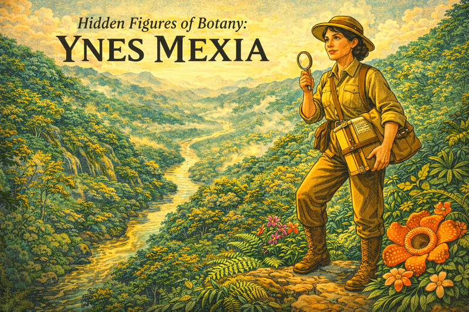

Cover Prompt

Please generate a wide-landscape 16:9 cover image for a graphic novel titled "Hidden Figures of Botany: Ynes Mexia." Use bright colors and high contrast.  Show a determined woman in her late 50s wearing a practical field hat, khaki expedition clothing, and leather boots, standing at the edge of a lush South American rainforest canopy. She holds a botanical press in one hand and a magnifying glass in the other. Around her feet are vivid tropical flowers and ferns. In the background, a winding river disappears into misty mountains. Include the title text "Hidden Figures of Botany: Ynes Mexia" in bold serif lettering across the top of the image. Use an early 20th-century naturalist illustration style with rich verdant greens, warm golds, and earthy browns. The emotional tone should be adventurous and inspiring.

Narrative Prompt

Narrate the life of Ynes Mexia (1870–1938) in an adventurous, empowering tone for high school biology students. Mexia was a Mexican-American botanist who did not begin her scientific career until age 51, enrolling at UC Berkeley after decades of personal hardship including two failed marriages, mental health struggles, and financial difficulties managing a ranch in Mexico. Despite starting late and facing gender bias and ethnic prejudice in early 20th-century academia, she became one of the most prolific plant collectors in history, amassing over 145,000 specimens and discovering more than 500 new species across the Americas — from Alaska's Denali to the headwaters of the Amazon. Emphasize her resilience, her love of nature, her solo expeditions through remote terrain, and her conservation legacy with the Sierra Club and Save the Redwoods League. Use an Art Nouveau / early Modernist visual style reflecting the 1920s–1930s period. Balance scientific rigor with the spirit of adventure, showing students that it is never too late to follow a passion and make world-changing contributions to science.

### Prologue – A Late Bloom

Most botanists start their careers in their twenties, fresh from university lecture halls. Ynes Mexia was fifty-one when she first enrolled at UC Berkeley, and fifty-five when she set out on her first solo expedition into the mountains of western Mexico. Over the next thirteen years she would travel from Alaska to the southern tip of South America, collecting over 145,000 plant specimens and discovering more than 500 species new to science. Her story proves that the best time to begin is whenever you are ready.

## Panel 1: A Diplomat's Daughter

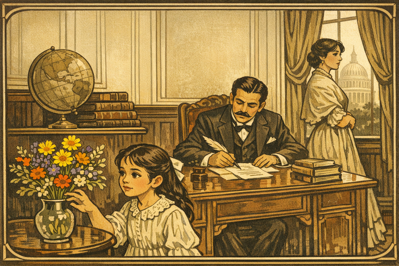

Image Prompt

This session will be a series of illustrations for a graphic novel about Mexican biologist Enrique Mexia.

Use an Art Nouveau / early Modernist visual style reflecting the 1920s–1930s period. Use a bright pallet of colors that pop out at the user and have a Mexican color theme.  Balance scientific rigor with the spirit of adventure, showing students that it is never too late to follow a passion and make world-changing contributions to science.

Please generate a 16:9 image in a warm, late-Victorian illustration style depicting Panel 1. The scene shows a young girl of about 10 years old with dark hair and curious eyes standing in a grand but austere parlor in Washington, D.C., circa 1880. Her father, Mexican diplomat Enrique Mexia, sits at a mahogany desk signing documents with a quill, dressed in a formal dark suit. Her mother, Sarah Wilmer, stands near a window looking distant and melancholy. Through the tall window, the U.S. Capitol dome is faintly visible. A globe, stacked leather-bound books, and a vase of wildflowers sit on a side table — the wildflowers are the only vibrant color in the otherwise muted room. The girl reaches toward the flowers with fascination. The color palette uses muted creams, dark woods, and a single splash of wildflower color (yellow, violet, orange). The emotional tone is bittersweet — privilege mixed with family tension.

Ynes Enriquetta Julietta Mexia was born on May 24, 1870, in Georgetown, Washington, D.C., the daughter of Mexican diplomat Enrique Mexia and Sarah Wilmer. Her childhood was shaped by constant upheaval — her parents separated early, and she was shuttled between schools in Philadelphia, Ontario, and Maryland. Even as a girl surrounded by politics and formality, Ynes found herself drawn to the natural world, pressing wildflowers between the pages of her father's books.

## Panel 2: Thirty Years in Mexico

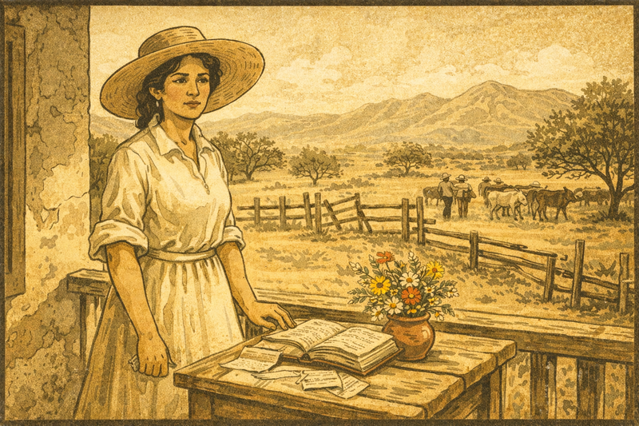

Image Prompt

Please generate a 16:9 image in a sun-bleached, early Modernist illustration style depicting Panel 2. The scene shows Ynes Mexia in her late 30s, standing on the porch of a weathered hacienda in rural Mexico, circa 1905. She wears a plain cotton dress with rolled-up sleeves and a wide-brimmed straw hat. Behind her stretches arid ranchland with scattered mesquite trees and a distant mountain range shimmering in heat haze. A wooden fence is in disrepair. On a rough table beside her sits a ledger book, scattered receipts, and a small clay pot of wildflowers she has gathered. Her expression is weary but resolute. In the background, ranch workers tend livestock. The color palette features dusty ochres, bleached whites, sage greens, and terracotta. The emotional tone conveys endurance and quiet determination during difficult years.

After her father's death, Mexia moved to Mexico City, where she managed the family ranch for nearly three decades. She married twice — her first husband died shortly after the wedding, and her second marriage ended in divorce amid financial hardship. These were lonely, grueling years spent far from any scientific community. Yet even while balancing account books and overseeing livestock, she collected local plants and studied the landscape around her, nurturing a passion she did not yet have a name for.

## Panel 3: A New Beginning at Fifty-One

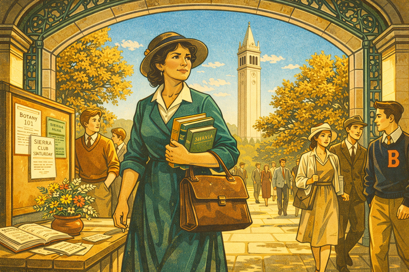

Image Prompt

Please generate a 16:9 image in an Art Deco / early Modernist style depicting Panel 3. The scene shows Ynes Mexia, now in her early 50s with graying dark hair pinned up under a modest hat, walking through the arched entrance of UC Berkeley's campus, circa 1921. She carries a leather satchel and a stack of botany textbooks. Around her, young students in 1920s collegiate clothing hurry past — some glance at her curiously. Sather Tower (the Campanile) rises in the background against a clear blue California sky. Oak trees line the path, their leaves golden in autumn light. A bulletin board near the entrance displays notices for "Botany 101" and "Sierra Club Hike — Saturday." The color palette uses warm golds, ivy greens, cream stone, and blue sky. The emotional tone is hopeful and courageous — a woman stepping into a new chapter of her life despite being decades older than her classmates.

In 1908, Mexia relocated to San Francisco seeking a fresh start. She joined the Sierra Club, hiked California's wild places, and discovered a community of naturalists who shared her love of plants. At fifty-one, she enrolled as a special student at UC Berkeley to study botany — walking into lecture halls filled with students half her age. She did not let self-consciousness slow her down. For the first time in her life, the passion she had carried for decades had a scientific framework around it.

## Panel 4: First Expedition — and First Fall

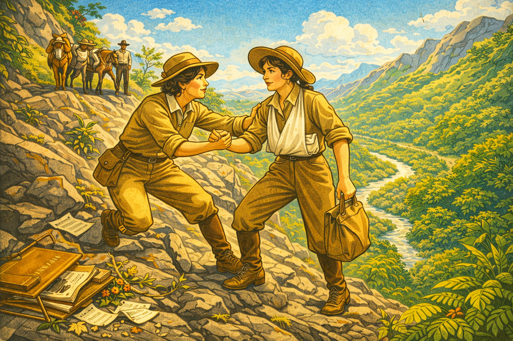

Image Prompt

Please generate a 16:9 image in an Art Deco adventure-illustration style depicting Panel 4. 
Use a brighter pallet of colors showing a progression of positive discovery.
The scene shows a botanical field expedition in the mountains of Sinaloa, Mexico, in 1925. Ynes Mexia, age 55, in sturdy khaki field clothes, a wide-brimmed hat, and leather boots, is being helped to her feet by expedition leader Roxana Ferris (a younger woman in similar field attire) after a serious fall on a steep rocky slope. Mexia's arm is in a makeshift sling, but she clutches a specimen bag in her free hand. Scattered around them are a broken botanical press, fallen plant cuttings, and loose journal pages. Below the slope, dense tropical vegetation stretches to a river valley. Two Mexican guides with pack mules wait on the trail above. The bright color palette features jungle greens, rocky grays, warm khaki, and golden afternoon light. The emotional tone is dramatic but resilient — a setback that does not end the journey.

In 1925, Mexia joined a Stanford University expedition to Sinaloa, Mexico, led by botanist Roxana Ferris. It was her first real fieldwork — and it nearly ended her career before it started. While climbing a steep slope to reach a promising collecting site, she fell and seriously injured herself. But even as she was helped back to camp with her arm in a sling, she refused to release the specimen bag she had filled that morning. She returned home with over 500 specimens and an unshakable conviction: this was the work she was born to do.

## Panel 5: Solo into the Sierra Madre

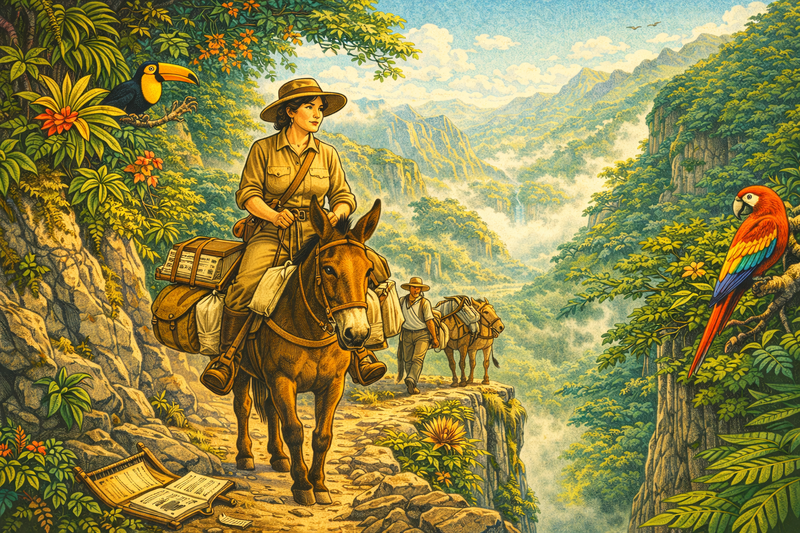

Image Prompt

Please generate a 16:9 image in an Art Deco naturalist style depicting Panel 5 using a bright high-contrast pallet of colors. The scene shows Ynes Mexia riding a mule along a narrow mountain trail in the Sierra Madre of western Mexico, circa 1926. She wears practical field clothing, a wide hat, and carries a botanical press strapped to the mule's pack saddle alongside canvas bags bulging with specimens. Behind her, a local Indigenous guide leads a second pack mule loaded with camping gear. The trail winds along the edge of a deep canyon filled with tropical forest — bromeliads and orchids cling to cliff faces. Morning mist rises from the valley below. Birds (toucans, parrots) perch in the canopy. The color palette features rich verdant lush greens, misty blues, warm earth tones, and golden morning light. The emotional tone is adventurous and serene — a woman fully in her element in wild terrain.

After recovering from her injuries, Mexia did something that stunned her Berkeley colleagues: she set out alone into the Sierra Madre of western Mexico. With Indigenous guides, pack mules, and her botanical press, she spent months traversing remote canyons and cloud forests that few scientists had ever visited. She collected in Nayarit, Jalisco, and Sinaloa, pressing hundreds of specimens each week and shipping crates back to UC Berkeley. At an age when most people considered retirement, Mexia was just hitting her stride.

## Panel 6: Three Thousand Miles Up the Amazon

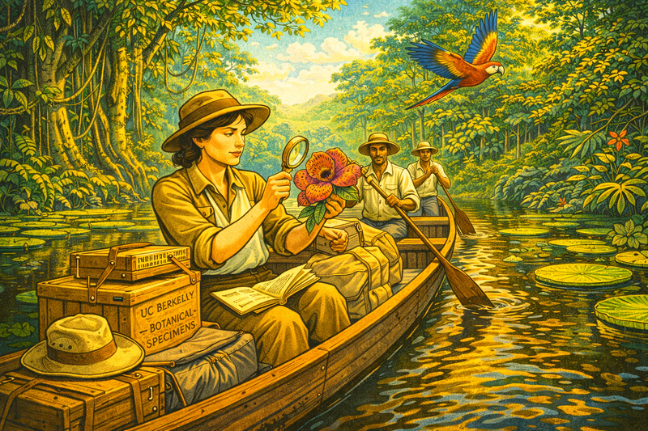

Image Prompt

Please generate a 16:9 image in an brightly colored high-contrast Art Deco adventure style depicting Panel 6. The scene shows Ynes Mexia seated in a wooden canoe on the Amazon River in Brazil, circa 1929. She is surrounded by towering rainforest on both banks — massive ceiba trees, trailing lianas, and giant water lilies floating near the shore. She holds an open specimen notebook in one hand and examines a large tropical flower (Rafflesia-like or orchid) with a hand lens. Two Brazilian river guides paddle the canoe. Stacked in the canoe are wooden crates marked "UC Berkeley — Botanical Specimens," a rolled canvas tent, and a battered field hat. A macaw flies overhead. Afternoon light filters through the canopy, casting dappled golden-green reflections on the dark water. The color palette features verdant deep jungle greens, river browns, golden light, and vivid tropical flower colors (bright red, intense purple, flame orange). The emotional tone is wonder and discovery — a scientist in the heart of the world's greatest biodiversity.

In 1929, Mexia embarked on the expedition that would define her legacy. She traveled nearly three thousand miles up the Amazon River by canoe, spending two and a half years collecting in the Brazilian and Peruvian rainforest. The journey yielded an astonishing 65,000 specimens — more than many botanists collect in an entire career. She documented the experience in her 1933 article "Three Thousand Miles up the Amazon" for the Sierra Club Bulletin, writing with the precision of a scientist and the wonder of an explorer encountering the world's richest biodiversity for the first time.

## Panel 7: A New Genus — Mexianthus

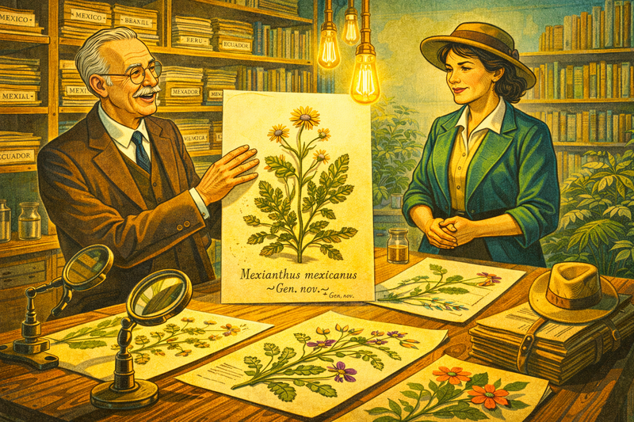

Image Prompt

Please generate a 16:9 image in a brightly colored high-contrast Art Deco scientific-illustration style depicting Panel 7. The scene shows a botanical laboratory at UC Berkeley, circa 1930. On a large oak table, pressed plant specimens are laid out under magnifying lenses and 1930s-style incandescent Edison filament light bulbs. Center stage is a carefully mounted specimen of Mexianthus mexicanus — a small daisy-like composite flower with distinctive ray florets — displayed on herbarium paper with a handwritten label reading "Mexianthus mexicanus — Gen. nov." and Mexia's name below. A senior male botanist (representing the taxonomist who named the genus) stands beside the table gesturing to the specimen with scholarly excitement. Mexia stands across the table, hands clasped, expression quietly proud. Shelves behind them hold rows of herbarium folders labeled "Mexico," "Brazil," "Peru," "Ecuador." The color palette features bright colors, cream paper, green pressed leaves, and golden light bulbs. The emotional tone is one of recognition and quiet triumph — a new genus bearing her name.

As Mexia's specimens reached herbaria across the country, taxonomists began recognizing species and even genera that had never been described. The crowning honor came when a new genus of flowering plant in the aster family was named *Mexianthus mexicanus* in her honor — a distinction granted to very few collectors. Over the course of her career, more than fifty species would bear her name, including *Mimosa mexiae*. For a woman who had entered science at fifty-one with no formal degree, this was a remarkable testament to the quality and volume of her fieldwork.

## Panel 8: Denali — The First Botanist

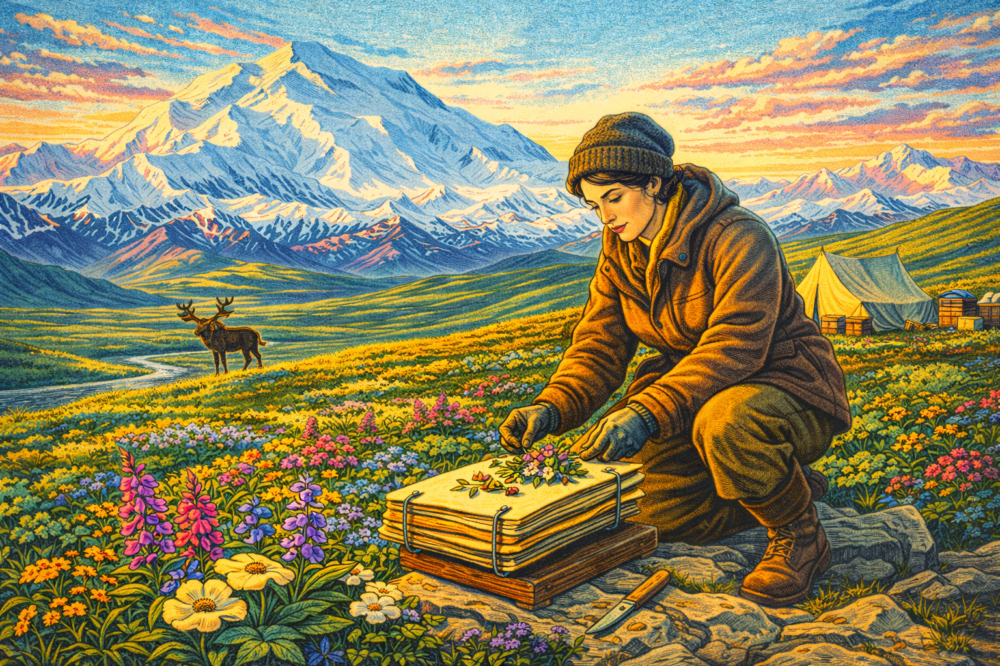

Image Prompt

Please generate a 16:9 image in a brightly colored high-contrast Art Deco / American Modernist style depicting Panel 8. The scene shows Ynes Mexia in Alaska's Denali region, circa 1928. She kneels on alpine tundra beside a patch of low-growing Arctic wildflowers (fireweed, lupine, mountain avens), pressing a specimen into a portable botanical press. Behind her rises the massive snow-covered peak of Denali (Mount McKinley), gleaming white and blue against a vast sky streaked with pink and gold from the midnight sun. A canvas tent and field camp are visible nearby. The tundra stretches in rolling verdant green and gold. A moose or caribou stands in the middle distance. Mexia wears a heavy wool jacket, leather boots, and a knit cap, her cheeks reddened by cold. The color palette features bright alpine whites, intensely bright glacier blues, tundra greens and golds, and sunset pinks. The emotional tone is awe and solitude — a scientist alone at the edge of the known botanical world.

Mexia's expeditions were not limited to the tropics. In 1928, she traveled to Alaska and became the first botanist to collect plant specimens in what is now Denali National Park. Kneeling on alpine tundra beneath the shadow of North America's highest peak, she pressed Arctic wildflowers that no scientist had documented before. From the equatorial Amazon to the subarctic tundra, her range was extraordinary — she collected across more ecological zones than almost any botanist of her era, male or female.

## Panel 9: "A Nature Lover and a Bit of an Adventuress"

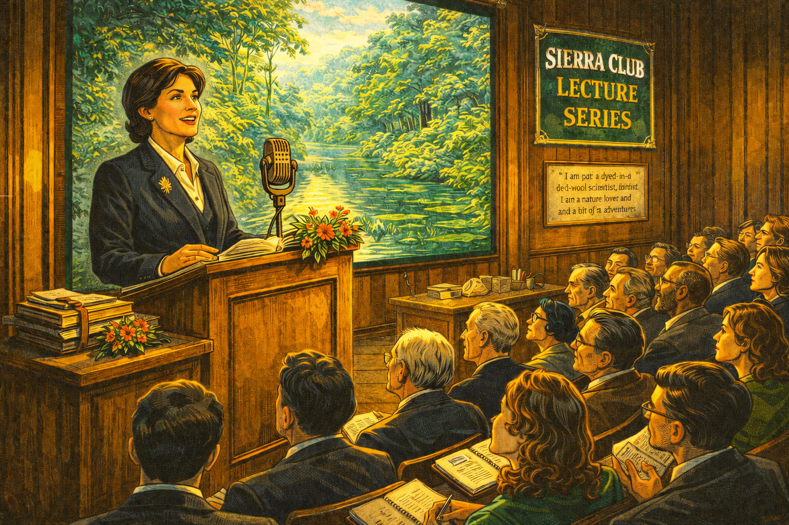

Image Prompt

Please generate a 16:9 image in a brightly colored high-contrast Art Deco portrait style depicting Panel 9. The scene shows Ynes Mexia at a podium in a wood-paneled lecture hall at the California Academy of Sciences, circa 1932. She is dressed in a smart dark suit with a botanical pin on her lapel, speaking to a packed audience. Behind her is a large projected photograph of a jungle river scene. On the podium sit her field notebooks and a small bouquet of pressed tropical flowers. The audience includes men and women scientists, students, and Sierra Club members — some lean forward with interest, others take notes. A banner reads "Sierra Club Lecture Series." On the wall beside the projection, a framed quote reads: "I am not a dyed-in-the-wool scientist. I am a nature lover and a bit of an adventuress." The color palette features rich wood tones, warm stage lighting, dark formal clothing, and the vivid green of the projected jungle image. The emotional tone is confidence and connection — a woman sharing her passion with the world.
Make the microphone look like it was in the 1930s. Use a old-style radio microphone.

Mexia became a beloved figure in California's scientific community, giving lectures at the California Academy of Sciences, the Sierra Club, and botanical societies. She described herself with characteristic humility: "I am not a dyed-in-the-wool scientist. I am a nature lover and a bit of an adventuress." But her audiences knew better — her meticulous specimen preparation, detailed field notes, and sheer volume of discoveries placed her among the most productive botanists of the twentieth century. She proved that passion and perseverance matter more than pedigree.

## Panel 10: Champion of Conservation

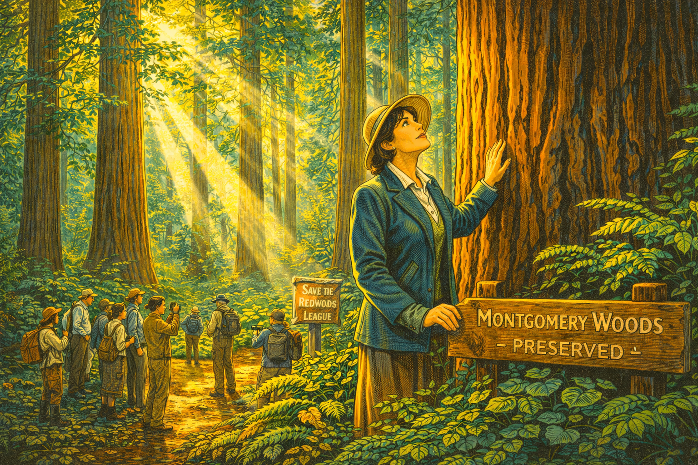

Image Prompt

Please generate a 16:9 image in a brightly colored high-contrast Art Deco / California Impressionist style depicting Panel 10. The scene shows Ynes Mexia standing among towering coast redwood trees in a northern California grove, circa 1933. Shafts of golden light pierce the canopy high above, illuminating ferns and sorrel on the forest floor. She places her hand on the bark of an enormous redwood trunk, looking upward with reverence. Beside her, a wooden sign reads "Montgomery Woods — Preserved." A Sierra Club hiking group gathers nearby, some taking photographs, others examining the understory plants Mexia has pointed out. A "Save the Redwoods League" banner is visible on a trail post. The color palette features deep redwood browns, verdant emerald greens, golden light shafts, and forest-floor amber. The emotional tone is reverence and purpose — a scientist who fights to protect what she studies.

Mexia was not content merely to collect and classify — she fought to protect the ecosystems she studied. As an active member of the Sierra Club and the Save the Redwoods League, she advocated fiercely for preserving California's ancient redwood forests and wild places. She understood that biodiversity was fragile, that the same forests yielding new species could be logged to nothing within a generation. A redwood grove at Montgomery Woods State Natural Reserve in Mendocino County was later named in her honor — a living monument to a woman who saw conservation and science as inseparable.

## Panel 11: The Final Expedition

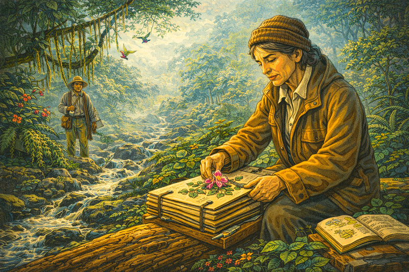

Image Prompt

Please generate a 16:9 image in a brightly colored high-contrast Art Deco style with somber undertones depicting Panel 11. The scene shows Ynes Mexia, visibly older and thinner at age 67, collecting specimens in the highlands of Oaxaca, Mexico, in 1938. She sits on a fallen log beside a mountain stream, carefully pressing a delicate orchid into her botanical press. Her field jacket hangs loosely on her frame. A local guide watches with concern from nearby, holding a canteen and a blanket. The surrounding cloud forest is misty and beautiful — epiphytes drape from branches, hummingbirds hover near flowers. Despite her frailty, Mexia's eyes are sharp and focused on the specimen. Her field notebook lies open beside her, filled with careful notes. The color palette features misty greens, cool mountain blues, soft whites, and warm amber light on Mexia's face. The emotional tone is bittersweet — beauty and determination in the face of declining health.

In 1938, at sixty-seven, Mexia set out on what would be her final expedition — collecting in the highlands of southern Mexico. She had been experiencing health problems but refused to stop. During this trip, she became seriously ill and was forced to return to Berkeley, where she was diagnosed with lung cancer. Even in her final months, she worked to organize and label her latest specimens, ensuring that every plant she had gathered would reach the herbaria that depended on her work. Ynes Mexia died on July 12, 1938, just thirteen years after her first expedition — but what a thirteen years they had been!

## Panel 12: A Legacy in 145,000 Specimens

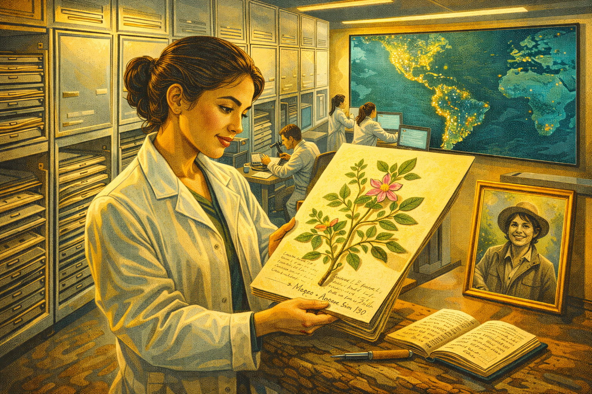

Image Prompt

Please generate a 16:9 image in a warm, brightly colored high-contrast celebratory Art Deco style depicting Panel 12. The scene shows a modern herbarium (circa present day) with floor-to-ceiling metal cabinets. A young Latina graduate student in a lab coat carefully examines a pressed herbarium sheet labeled "Collected by Y. Mexia — Amazon Basin, 1930." On the sheet, a beautifully preserved tropical plant is mounted with Mexia's handwritten field notes visible. Behind the student, dozens of open herbarium cabinets reveal thousands of mounted specimens. On the wall hangs a framed black-and-white portrait of Ynes Mexia in field clothing, smiling. A digital screen nearby displays a map of the Americas with glowing dots marking all of Mexia's collecting sites — from Alaska to Patagonia. Other researchers work at microscopes and computers in the background. The color palette features warm wood, cream herbarium paper, green pressed plants, bright modern lighting, and the golden glow of the portrait frame. The emotional tone is gratitude and continuity — Mexia's work lives on in the hands of a new generation.

Today, Ynes Mexia's 145,000 specimens are preserved in herbaria across the world, still consulted by researchers studying biodiversity, taxonomy, and climate change. The genus *Mexianthus* and more than fifty species bearing her name ensure she will never be forgotten. She left her estate to the Sierra Club and the Save the Redwoods League, extending her conservation work beyond her lifetime. For a woman who did not pick up a botanical press until her mid-fifties, Mexia's legacy is staggering — proof that scientific greatness has no expiration date and that the natural world rewards those brave enough to explore it on their own terms.

### Epilogue – What Made Ynes Mexia Different?

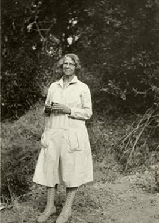

Mexia combined fearless curiosity with meticulous scientific practice. She refused to let age, gender, ethnicity, or personal hardship define her limits. In just thirteen years of active fieldwork, she outpaced collectors who had spent entire careers in the field. Her story teaches us that passion pursued with discipline can accomplish more in a decade than timidity achieves in a lifetime.

| Challenge | How Mexia Responded | Lesson for Today |
|-----------|---------------------|------------------|
| Starting a scientific career at age 51 | Enrolled at UC Berkeley as a special student, sought mentors, and threw herself into fieldwork | It is never too late to pursue your passion; age is not a barrier to discovery |
| Gender and ethnic bias in 1920s academia | Let her specimen count and species discoveries speak louder than prejudice | Quality work earns respect regardless of background; let results be your argument |
| Serious injury on her first expedition | Recovered, then launched solo expeditions even more ambitious than the first | Setbacks are data points, not endpoints; resilience defines a career |
| Working without a formal degree | Partnered with herbaria and taxonomists, maintained rigorous field methods | Credentials matter less than competence; meticulous work builds credibility |
| Declining health in her final years | Continued collecting and organizing specimens until she physically could not | Commitment to your work honors both the science and the communities that depend on it |

### Call to Action

Ynes Mexia showed that the best time to start is now — not when conditions are perfect, not when everyone approves, but when your curiosity demands it. Look at the plants around your own school, neighborhood, or hiking trail. Use the Biodiversity MicroSims in this course to explore how species are classified and why every specimen matters. You do not need a perfect resume to make a difference — you need a notebook, a keen eye, and the courage to go where the questions lead.

---

*"I am not a dyed-in-the-wool scientist. I am a nature lover and a bit of an adventuress."*
—Ynes Mexia

---

*"In all my travels I've never been attacked by a wild animal, lost my way or caught a disease."*
—Ynes Mexia

---

## References

1. [Ynes Enriquetta Julietta Mexia — Britannica](https://www.britannica.com/biography/Ynes-Enriquetta-Julietta-Mexia) - Comprehensive biographical entry covering Mexia's family background, education at UC Berkeley, major expeditions, and scientific discoveries including the genus Mexianthus.
2. [Ynes Mexia — U.S. National Park Service](https://www.nps.gov/people/ynes-mexia.htm) - Profile highlighting Mexia's role as the first botanist to collect in Denali National Park and her conservation legacy with the Sierra Club and Save the Redwoods League.
3. [Late Bloomer: The Short, Prolific Career of Ynes Mexia — New York Botanical Garden](https://www.nybg.org/blogs/science-talk/2015/02/late-bloomer-the-short-prolific-career-of-ynes-mexia/) - Detailed account of Mexia's remarkably productive 13-year collecting career and the lasting impact of her 145,000 specimens on botanical research.
4. [Ynés Mexía: Mexican-American Botanist and Adventurer — PBS American Masters](https://www.pbs.org/wnet/americanmasters/ynes-mexia-accomplished-latina-botanist-k6bggm/13948/) - Profile exploring Mexia's personal challenges, her Amazon River expedition, and her significance as a Latina pioneer in American science.
5. [145,000 Plants with Adventuress Ynes Mexia — Library of Congress](https://blogs.loc.gov/inside_adams/2024/10/ynesmexia/) - Library of Congress feature documenting the scope of Mexia's collection and her article "Three Thousand Miles up the Amazon" in the Sierra Club Bulletin.
6. [Ynes Mexia — California Academy of Sciences](https://www.calacademy.org/scientists/library/untold-stories/ynes-mexia) - Academy profile covering Mexia's membership in the California Academy of Sciences and her contributions to West Coast botanical knowledge.
